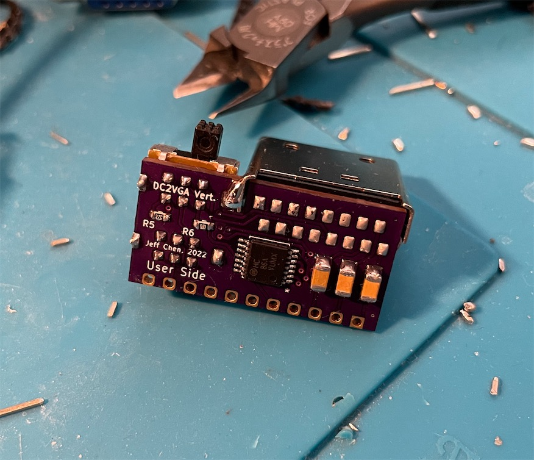
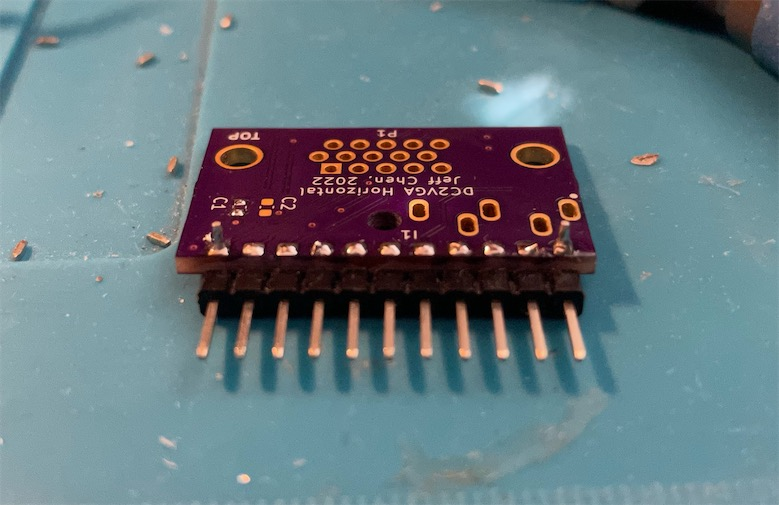
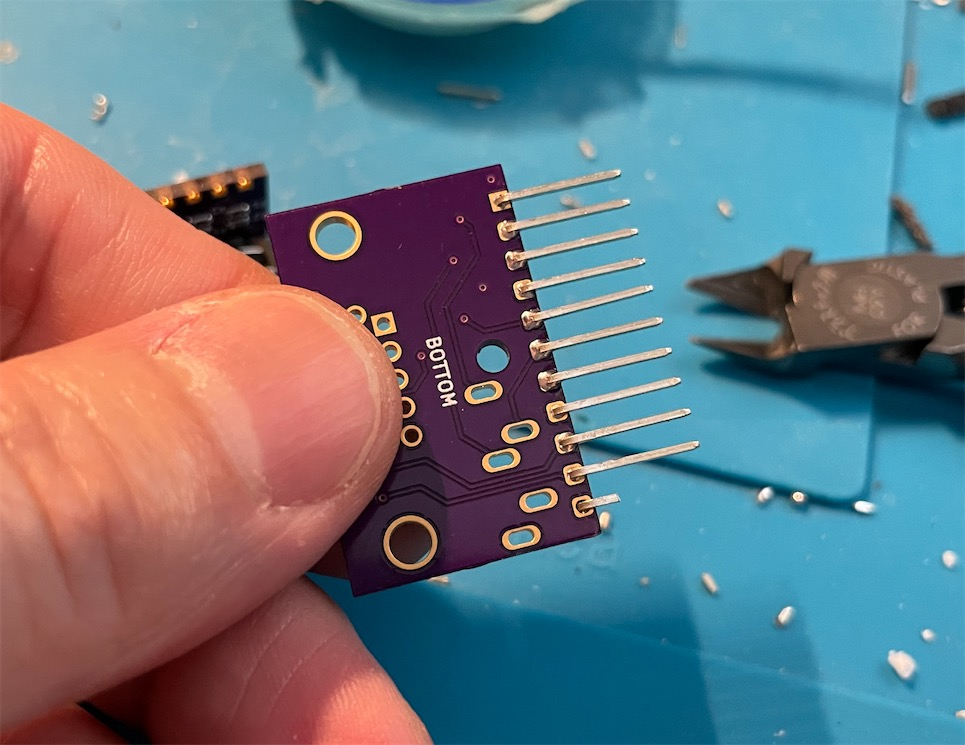

# DC2VGA

An SD/VGA RGBS/RGBHV Switchable Dongle for Sega Dreamcast.

This belongs to my [series of VGA adapters](https://github.com/jeffqchen/Console-VGA-Dongle-Series) for various retro consoles and video equipments.

This adapter plugs into the AV OUT port on a Sega Dreamcast and allows you to out put RGBS or RGBHV video signal, as well as a stereo audio signal.

------------
## Usage

### Toggling Modes

There are two independent toggle switches on this dongle for choosing different modes.

- SD / VGA allows you to choose between 525i (SD) and 525p (VGA) RGB output
- CSYNC / HV allows you to choose between attenuated CSync and 3.3V H/V-Sync

I have tested this dongle with various devices:

|              | SD+CSync | VGA+CSync | SD+HV  | VGA+HV    |
|--------------|----------|-----------|--------|-----------|
| RetroTINK 5X | **Yes**  | **Yes**   | No     | No        |
| OSSC (AV3)   | Yes*     | **Yes**   | **Yes**| **Yes**   |
| GBS Control  | **Yes**  | **Yes**   | Yes*   | Yes*      |
| PVM/BVM      | **Yes**  | *Unsure*  | No     | No        |
| PC Monitors  | No       | No        | No     | **Yes**   |

The No ones are mostly device limitations and not a problem with the dongle itself.

The Yes* ones means they only work when the signal first went through an Extron switch. It's probably that the switch reconditioned the signals in some way to overcome the limitations of these devices and made things work. A direct connection does not work in these cases and it's expected.

The only real compatibility issue I've encountered so far, is **VGA** mode + **CSync** on Sony BVM D series. This BVM doesn't like combined CSync and will not display it properly. **However it will work properly in SD mode.**

#### *VGA Trick*

*(Bust-A-Move 4 tricked into run in VGA mode)*

Some games that require an SD cable can be forced into VGA mode by toggling the top switch from SD to VGA, right after booting up the game (at the VMU beep or right after game started from the ODE).

### Audio

Audio can be carried inside the VGA cable as-is, or extracted from the 3.5mm jack on the dongle.

* *Buzzing may be noticeable when audio is transmitted within the VGA cable in certain scenes in certain games. This is due to insufficient shielding in most VGA cables. If you find the buzzing to be annoying, use the 3.5mm jack on the dongle for audio output. This will ensure the cleanest possible audio.*

### Other Use Cases

Light guns work if you output to a CRT display (TV and PC monitor).

 -----------

 ## Parts

- PCB (You need both)
  - [Vertical PCB](https://oshpark.com/shared_projects/WcKgCnij)
  - [Horizontal PCB](https://oshpark.com/shared_projects/jPAbQ0ej)

- [1x] Dreamcast AV Plugs - [Link](https://github.com/jeffqchen/JeffParts/blob/main/Connectors/Dreamcast%20AV%20Plug/info.md)

- [2x] Toggle Switches (SW1 & SW2) - [Link](https://github.com/jeffqchen/JeffParts/tree/main/Switches/EG2208%20Toggle%20Switch/info.md)

*If you want slightly longer switch stems, use **EG2208A** instead.*

- [1x] VGA Port Slim Female - [Link](https://github.com/jeffqchen/JeffParts/tree/main/Connectors/VGA%20Slim%20Female%20Through%20Hole/info.md)

- [1x] 3.5mm Headphone Jack - [Link](https://github.com/jeffqchen/JeffParts/blob/main/Connectors/3.5mm%20Audio%20Jack/Vertical%205-Pin%20PCB/info.md)

- [1x] M2x20mm screw and hex nut - [Link](https://github.com/jeffqchen/JeffParts/blob/main/Parts/M2%20M3%20Hex%20Screw%20%26%20Nut/info.md)

- 2.54mm-Pitched Right Angle Pin Header (at least 11-pin wide) - [Link](https://github.com/jeffqchen/JeffParts/blob/main/Connectors/Pin%20Header/2.54mm%20Pitch/Male%20Right-Angle/info.md)

### SMD Components

*All SMD resistors and capacitors are in imperial 0603 size unless specified otherwise*

#### On Vertical Board
- **U1**: [1x] 4-Channel XOR Logic Gate, 14TSSOP - MC74HC86ADTR2G Quad XOR Gate - [[Link](https://github.com/jeffqchen/JeffParts/blob/main/Components/MC74HC86ADTR2G%20Quad%20XOR%20Gate/info.md)]
- **C1 C2 C3**: [3x] 220uF / 6.3V / **Imperial 1206 Size** - [[Link](https://github.com/jeffqchen/JeffParts/blob/main/Components/220uF%20SMD%20Cap/info.md)]
- **C4**: [1x] 0.1uF / 10V
- **C5 C6**: [2x] ]1uF / 10V
- **R1 R2**: [2x] 150 Ohm
- **R3 R4**: [2x] 10K Ohm

**R5 and R6** can have different configurations. Choose one from the following:
- For 0.6V Vpp CSync: (common attenuated CSync level)
  - R5: 25 Ohm
  - R6: 680 Ohm

- For 0.3V Vpp CSync: (SCART-safe sync level)
  - R5: 75 Ohm
  - R6: 1K Ohm

#### On Horizontal Board
- C1 C2: [2x] 10uF / 6.3V

-----------

## 3D Printing

Print all parts in their original orientations.

The shells are printed on the 3.5mm port side to give it a flat surface on that side and better details on the top.

Try using tree support as it's easier to extract and leaves less damage to up-facing surfaces below supported surfaces.

Make sure all support material is removed before trying to fit the electronics inside, as there is zero space to spare inside.

### Without A Shell

Thanks to [Retro Gamer Stuff](https://twitter.com/RetroGamerStuff)'s suggestion, I've adopted right-angle pin headers to interconnect the two PCBs with a very reliable connection. This means the internal assembly should be able to sustain even without a shell. It will be unsightly, but should be strong enough regardless.

-----------

## Preparations

### Dreamcast Video Plug

The original Dreamcast video plug has a cross bar to prevent the pins from falling out. You need to extract it with a side cutter or dental pick like shown in the picture. Try prying from the center of the bar so it lifts cleanly.

*IF* a pin falls out during the process, simply carefully push it back into its original place.

Put the printed "Plug Helper" piece over the pins. Note the correct side of the slot. Then push it all the way into the back of the plug until it's flush.

This piece helps to maintain a leveled surface so the plug can be soldered to the PCB reliably.

### PCB

Trim extra tabs sticking outside from the PCB outline with a side-cutter and file. Otherwise you may run into issues trying to fit the assembly into the 3D printed shell.

-----------

## Assembly

Populate the horizontal and vertical PCBs with all of the SMD components first.

Solder in the Dreamcast video plug and the switches onto the "DC Side" of the vertical board.

Note the DC video plug should be perpendicular to the vertical PCB.

There is an area of exposed copper next to the DC video plug. You can add some solder in this area to further strengthen the connection between the plug and the PCB. However it's only optional.

Cut a section of the pin header with 11 pins. Fit the bent end onto the horizontal PCB from the bottom side, as close as possible. Then solder in the two ends first.

You can adjust the pin header by melting the two ends. Make sure the straight part of the pin header is parallel to the PCB as much as possible.

Now start trimming out the extra length of the pins on the bent end. Make it as flush as possible to the PCB. Do the unsoldered pins in the middle first, then solder the flush pins to the PCB.

Lastly, suck up any excessive solder from the two end pins, and then trim them flush as well.

Using a cutter, cut and remove the black plastic piece that holds all the pins together. Try cutting in with a light angle so the cuts reach the pins for an easy removal.

Now solder in the VGA and 3.5mm port tightly onto the horizontal PCB.

Trim the 3 pins that would be blocked by the toggle switch. Refer to the photos for an easier way to get it done.

Temporarily fit the entire assembly into the top shell. Position the PCBs so the 3.5mm port and VGA port fits into the cutouts on the top shell snugly, and the vertical PCB is as vertical as possible.

 Solder the 3 trimmed pins and the one on the other end, to hold the assembly together.

Take the assembly out of the 3D printed shell. We do NOT want to do a lot of soldering when the assembly is inside the shell, or the heat may damage it.

Go on and trim all the rest of the excessive straight pins and solder them in place. Feed an ample amount of solder and heat up the pin long enough so the solder could seep into the vias on the vertical PCB.

Inspect the other side and make sure the vias are filled by solder. If not, heat it up again with a bit more solder. The internal assembly is now finished.

Now, fit the completed internals into the bottom shell, then put the top shell over it and close it up.

Secure the shells with a set of M2x20mm screw and nut.

------------
## Some Technical Nuances

### Native CSync

This Dongle uses the native CSync signal generated by the Dreamcast itself - when it's set to SD mode. This mode has the best compatibility with SD TVs and monitors.

### Combined CSync

When set to VGA mode **AND** CSync, the circuit inside uses an XOR logic chip to combine the native HSync and VSync signals into an artificial CSync signal. This signal has a slight discrepancy from a standard CSync signal, and some equipments that rely on PLL (phase lock loop) would be thrown off (as documented in the [HDRetrovision Blog](https://www.hdretrovision.com/blog/2019/10/10/engineering-csync-part-2-falling-short)).

This issue was anticipated and since in most cases, you would not run into any issue, I opted to not dig deeper and further complicate the design.

### OSSC AV3 Input Limitations

The AV3 input on the OSSC require clean TTL-level sync signals. However the native CSync output from the Dreamcast is an attenuated one. This signal does not work with the OSSC and is expected.

*Source: [OSSC Wiki](https://junkerhq.net/xrgb/index.php/OSSC#AV3_.28VGA.29)*

### GBS Control Limitations
The GBS 82XX board does not work nicely with VGA signals. [Robert Neumann](https://twitter.com/_ramapcsx2) put in some time hoping to make it work but decided it's not a suitable use case for the GBS board. So the RGBHV signal coming from the Dreamcast not working with GBS is expect. You should always use CSync instead.

### Improved Compatibility with Extron switches
By running the signal through an Extron MVX Switch, several of the incompatibilities mentioned above could be overcome. It probably thanks to the extra signal conditioning it performances on the inside. These Extron devices are lovely.

**But you should always remember that they output 5V TTL sync and that needs to be properly attenuated if connected to a consumer device.**

-----------
## Special Thanks
Mike Chi
- Twitter: https://twitter.com/retrotink2
- Official Website: https://www.retrotink.com/

HDRetrovision
- Twitter: https://twitter.com/hdretrovision
- Official Website: https://www.hdretrovision.com/

Javier Rodas
- Twitter: https://twitter.com/JaviRodasG

Robert Neumann
- Twitter: https://twitter.com/_ramapcsx2

Retro Gamer Stuff (Bad_Ad84)
- https://twitter.com/RetroGamerStuff
